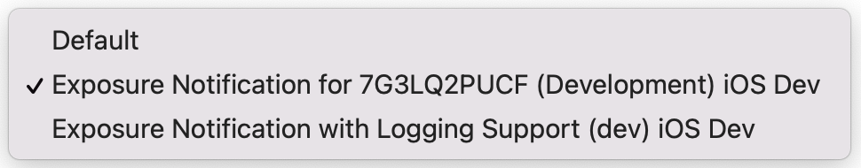
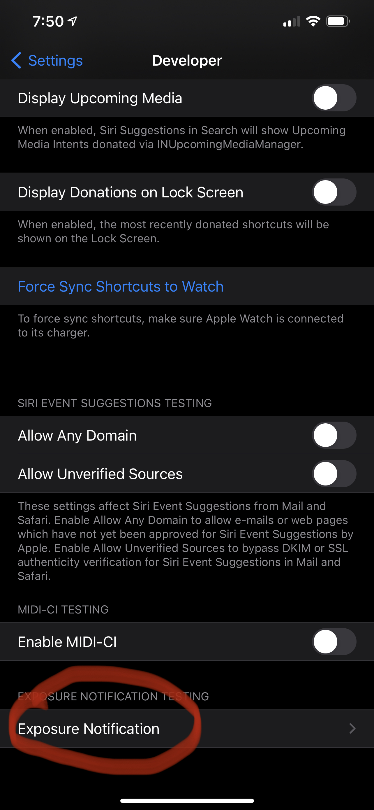
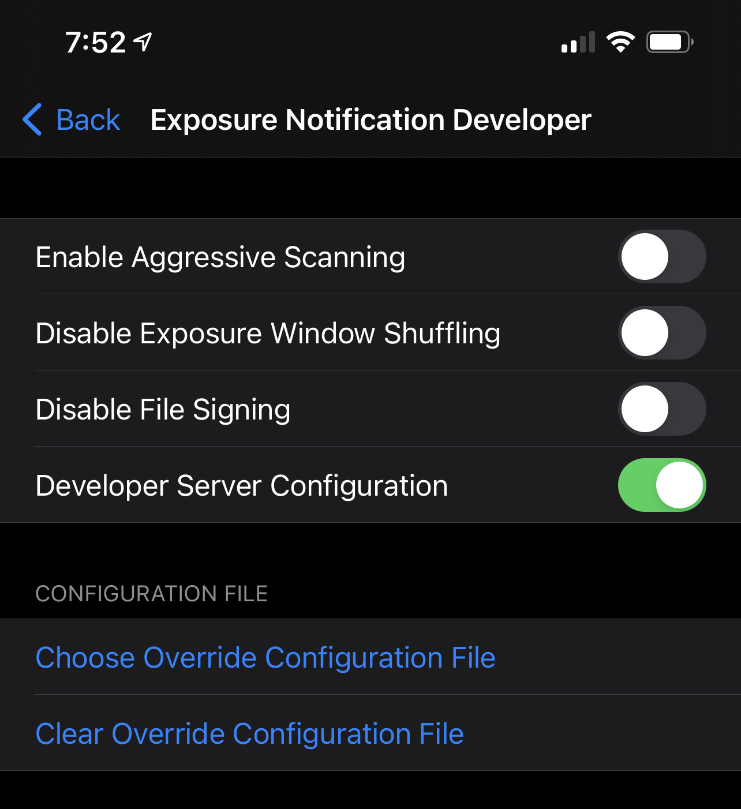
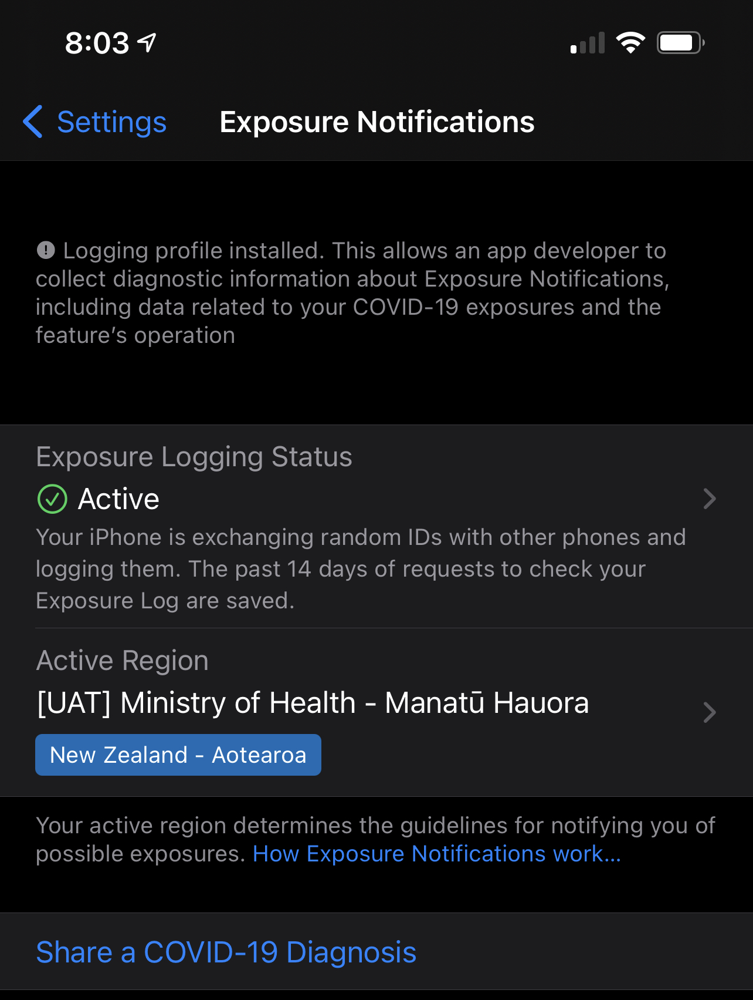
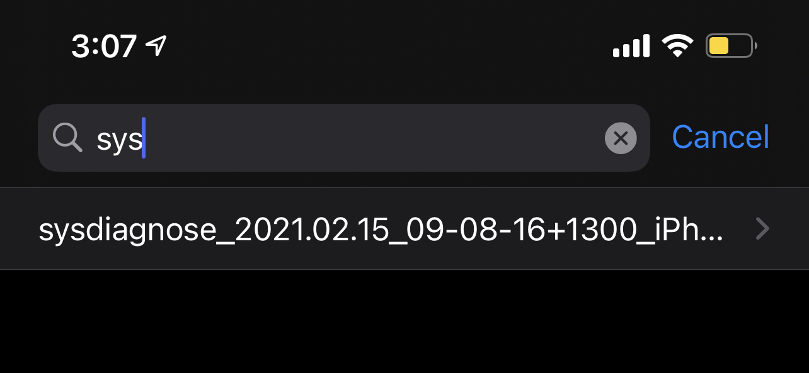
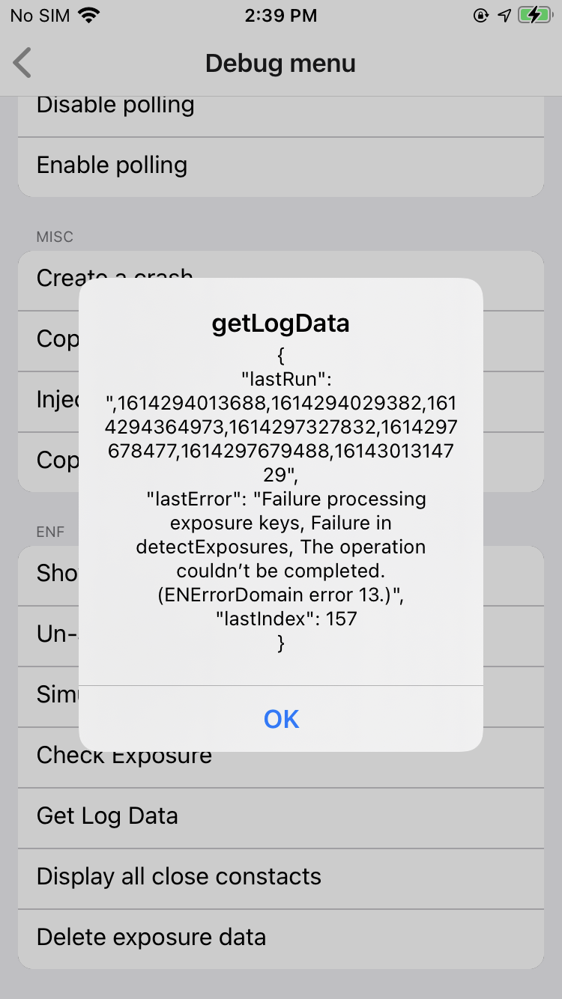

# iOS

## Prerequisites for ENS on iOS

### Provisioning profile

Provisioning profile should include one of the following entitlements
- Exposure Notification
- Exposure Notification with Logging Support

Those entitlements are selectable in the Apple Developer Acounts when creating/editing provisioning profiles. **Note**, ability to select either of those entitlements isn't enabled on any account by default. Apple would need to enroll an account for ENS following a request from the Public Health Authority of the corresponding country/state.



Support of the mentioned entitlements varies between different types of provisioning profiles. Thus Development profiles support both, but Ad Hoc and Distribution profiles only support "Exposure Notification".

Difference between the two Provisioning Profile Entitlements is described below.

### Local entitlements in the .entitlements file

The app in turn must declare the following entitlement (regardless of the selected Provisioning Profile Entitlement):

```xml
<?xml version="1.0" encoding="UTF-8"?>
<!DOCTYPE plist PUBLIC "-//Apple//DTD PLIST 1.0//EN" "http://www.apple.com/DTDs/PropertyList-1.0.dtd">
<plist version="1.0">
<dict>
    <!-- ... -->
	<key>com.apple.developer.exposure-notification</key>
	<true/>
    <!-- ... -->
</dict>
</plist>
```

When "Exposure Notification with Logging Support" is selected, it enables several other entitlements useful for development/testing:
- `com.apple.developer.exposure-notification-test` - According to Apple, allows to test EN-enabled apps in the debug environment. However, the app seems debuggable even without it, so it's not clear what is its added utility. This will also allow the app to get diagnosis keys immediately by calling `getAndPostTestDiagnosisKeys` method without waiting for a fixed period. 
- `com.apple.developer.exposure-notification-test-skip-file-verification` - Allows EN-enabled apps to bypass signature verification when calling `detectExposures` method.
- `com.apple.developer.exposure-notification-logging` - Allows additional profiling, as well as generation of diagnostic logs used for investigating potential issues with ENS. Those logs are typically used when a development team wants to seek help from Apple. In order to capture the logs, a special device profile "Exposure Notifications Logging" needs to be installed on device. That profile is provided by Apple upon request. The process of capturing the logs is described further below.

### ENAPIVersion and ENDeveloperRegion in Info.plist

Info.plist should specify either `1` or `2` for `ENAPIVersion`, as well as `ENDeveloperRegion`, e.g.:

```xml
<?xml version="1.0" encoding="UTF-8"?>
<!DOCTYPE plist PUBLIC "-//Apple//DTD PLIST 1.0//EN" "http://www.apple.com/DTDs/PropertyList-1.0.dtd">
<plist version="1.0">
<dict>
	<!-- ... -->
	<key>ENAPIVersion</key>
	<string>1</string>
	<key>ENDeveloperRegion</key>
	<string>NZ</string>
    <!-- ... -->
</dict>
</plist>
```

The value of `ENDeveloperRegion` should be the same between Info.plist and configuration maintained by Apple [configuration maintained by Apple](#apple-configuration).

When `ENAPIVersion = 1` v2 EN APIs are not available to the app and vice versa, when `ENAPIVersion = 2` v1 EN APIs are not available to the app. More on the differences between the APIs:
- v1 is supported by iOS13.5+. [More info](https://developer.apple.com/documentation/exposurenotification/enexposureconfiguration/exposure_risk_value_calculation_in_exposurenotification_version_1).
- v2 is supported by iOS 12.5 and iOS13.7+. This version introduces new APIs and configuration parameters for `detectExposures`. [More info](https://developer.apple.com/documentation/exposurenotification/enexposureconfiguration).

In order to use v2 it must be set both in Info.plist and in [configuration managed at the Apple's side](#apple-configuration)

### Apple configuration

Apple maintains a centralised configuration for all EN-enabled regions and applications.

During initial registration as a Public Health Authority (PHA), Apple ask for some values, e.g.:

```
Country: New Zealand
MCC: 530
Bundle Identifier: nz.govt.health.covid-tracing-app
Version: v1
Public Key: <public_key>
agencyDisplayName_EN_NZ: Ministry of Health - Manatū Hauora
agencyDisplayName_MI_NZ: Manatū Hauora (Ministry of Health)
agencyRegionName_EN_NZ: New Zealand - Aotearoa
agencyRegionName_MI_NZ: Aotearoa
agencyHeaderStyle: 2
agencyHeaderTextColor: [1.0, 1.0, 1.0]
agencyImage: https://static.tracing.covid19.govt.nz/images/moh_logo_inv_62px@3x.png
agencyColor: [0.04, 0.42, 0.71]
agencyMessage_EN_NZ: Thanks for downloading NZ COVID Tracer to help stop the spread of COVID-19. For more information visit health.govt.nz.
agencyMessage_MI_NZ: Tēnā koe i tō tiki ake i te NZ COVID Tracer hei āwhina i te mahi haukoti i te rere o KOWHEORI-19. E kitea ai te nuinga o ngā kōrero mō tēnei taupānga, toro atu ki health.govt.nz
```

The provided values are used to populate a full JSON configuration that can be retrieved as follows:

```bash
curl "https://gateway.icloud.com/enservice/v2/app/config" -H 'x-apple-ct-region-identifier: NZ
```

That call will return something like this (e.g. for NZ in production):
```json
{
  "subdivisions": [],
  "appConfigs": [
    {
      "countryCode": "NZ",
      "state": "",
      "appBundleId": "nz.govt.health.covid-tracing-app",
      "publicKey": "<public_key>",
      "publicKeyVersion": "v1",
      "signAuthorityName": "signAuthorityName",
      "config": {
        "enVersion": 1,
        "reportTypeConfirmedClinicalDiagnosisWeight": 80,
        "agencyColor": [
          0.04,
          0.42,
          0.71
        ],
        "agencyHeaderSubtitle_EN_NZ": "",
        "isMatchingRestrictedRegion": false,
        "exposureDetailsBodyText_1_EN_US": "",
        "notificationBody_2_EN_NZ": "",
        "notificationSubject_3_EN_US": "",
        "hasStateRegions": false,
        "attenuationNearMedThreshold": 50,
        "tekLocalDownloadBasePath": "",
        "reportTypeConfirmedTestWeight": 100,
        "reportTypeNoneMap": 3,
        "attenuationImmediateWeight": 150,
        "exposureDetailsBodyText_4_EN_US": "",
        "regionDisabledTransitionGracePeriodMinutes": 1440,
        "perDayMaxERVThreshold_2": 0,
        "perDayMaxERVThreshold_3": 15,
        "perDayMaxERVThreshold_1": 60,
        "partnerTelemetryAppleCertificateChain": "",
        "infectiousnessHighWeight": 200,
        "perDayMaxERVThreshold_4": 0,
        "weightedDurationAtAttenuationThreshold_4": 0,
        "agencyRegionName_EN_NZ": "New Zealand - Aotearoa",
        "weightedDurationAtAttenuationThreshold_1": 60,
        "agencyHeaderStyle": 2,
        "weightedDurationAtAttenuationThreshold_3": 15,
        "publicHealthAuthorityTelemetryAppleCertificateChain": "",
        "weightedDurationAtAttenuationThreshold_2": 0,
        "status": "approved",
        "applicationBackgroundRuntimeIntervalinHours": 2,
        "attenuationImmediateNearThreshold": 30,
        "attenuationNearWeight": 100,
        "serverConfigVersion": 1,
        "V1Enable": true,
        "dynamicAlgorithmEnabled": true,
        "enEnabled": true,
        "notificationSubject_2_EN_US": "",
        "dynamicThrottleUpAdvDensity": 20,
        "legalConsentVersion": "1",
        "reportTypeSelfReportWeight": 50,
        "notificationBody_1_EN_NZ": "",
        "privacyParameterInputCandence": 7,
        "appleTelemetryEndpoint": "https://exposure-notification.apple.com",
        "attenuationMedWeight": 50,
        "agencyDisplayName_MI_NZ": "Manatū Hauora (Ministry of Health)",
        "clinicalDiagnosisPerDaySumERVThreshold_1": 45,
        "clinicalDiagnosisPerDaySumERVThreshold_2": 15,
        "notificationSubject_1_EN_US": "",
        "clinicalDiagnosisPerDaySumERVThreshold_3": 15,
        "rpiAdvertisementToleranceInMinutes": 120,
        "clinicalDiagnosisPerDaySumERVThreshold_4": 0,
        "reportTypeRecursiveWeight": 100,
        "forceAPWakeIntervalInMinutesThreshold": 5,
        "daysSinceExposureThreshold": 14,
        "classificationName_3": "",
        "classificationName_2": "",
        "classificationName_4": "",
        "classificationName_1": "",
        "enableRecursiveType": false,
        "detectExposureNKDLimit": 6,
        "rpiDuplicateAdvertisementToleranceInMinutes": 20,
        "agencyMessage_EN_NZ": "Thanks for downloading NZ COVID Tracer to help stop the spread of COVID-19. For more information visit health.govt.nz.",
        "agencyMessage_MI_NZ": "Tēnā koe i tō tiki ake i te NZ COVID Tracer hei āwhina i te mahi haukoti i te rere o KOWHEORI-19. E kitea ai te nuinga o ngā kōrero mō tēnei taupānga, toro atu ki health.govt.nz",
        "revokedNotificationBody_EN_NZ": "",
        "recursivePerDaySumERVThreshold_4": 15,
        "recursivePerDaySumERVThreshold_3": 30,
        "notificationBody_3_EN_NZ": "",
        "recursivePerDaySumERVThreshold_2": 0,
        "recursivePerDaySumERVThreshold_1": 0,
        "exposureDetailsBodyText_3_EN_US": "",
        "numberOfAdvSamplesForRPIThreshold": 1,
        "agencyHeaderTextColor": [
          1,
          1,
          1
        ],
        "infectiousnessStandardWeight": 100,
        "confirmedTestPerDaySumERVThreshold_1": 45,
        "notificationBody_4_EN_NZ": "",
        "confirmedTestPerDaySumERVThreshold_4": 0,
        "confirmedTestPerDaySumERVThreshold_2": 15,
        "legalConsentText_EN_NZ": "",
        "confirmedTestPerDaySumERVThreshold_3": 15,
        "osTriggeredAppRunTimeInSeconds": 300,
        "dynamicThrottleDownAdvDensity": 6,
        "enableChaff": true,
        "agencyRegionName_MI_NZ": "Aotearoa",
        "tekLocalDownloadIndexFile": "",
        "regionTransitionGracePeriodInMinutes": 180,
        "selfReportPerDaySumERVThreshold_3": 30,
        "selfReportPerDaySumERVThreshold_4": 15,
        "selfReportPerDaySumERVThreshold_1": 0,
        "agencyImage": "https://static.tracing.covid19.govt.nz/images/moh_logo_inv_62px@3x.png",
        "selfReportPerDaySumERVThreshold_2": 0,
        "dynamicThrottleDownRSSI": -55,
        "agencyDisplayName_EN_NZ": "Ministry of Health - Manatū Hauora",
        "tekPublishInterval": 24,
        "perDaySumERVThreshold_2": 0,
        "notificationSubject_4_EN_US": "",
        "callbackIntervalInMin": 1440,
        "perDaySumERVThreshold_1": 60,
        "exposureDetailsBodyText_2_EN_US": "",
        "perDaySumERVThreshold_4": 0,
        "perDaySumERVThreshold_3": 15,
        "dynamicThrottleUpDurationInMinutes": 900,
        "dynamicThrottleDownDurationInSeconds": 216,
        "attenuationMedFarThreshold": 65,
        "stateRegionConfigs": {},
        "attenuationOtherWeight": 0,
        "detectExposureDailyLimit": 20
      }
    }
  ]
}
```

It also seems possible to manage the above configuration directly (without having to ask Apple to make a change). More information [here](https://developer.apple.com/documentation/exposurenotification/changing_configuration_values_using_the_server_to_server_api). This mechanism is currently not implemented for NZ COVID Tracer App and consultation with Apple is highly suggested before using it.

## Configuring development and test devices on iOS (iOS 13.5+)

Detailed step-by-step setup process is described [here](https://developer.apple.com/documentation/exposurenotification/testing_exposure_notifications_apps_in_ios_13_7_and_later).

In short the process is:
1. Enable "Developer" menu in the Settings app on an iPhone.
2. Enable "Exposure Notification" in the "Developer" menu by installing the device profile "Exposure Notification Developer Settings" (it won't show until the profile is correctly installed). The profile is provided by Apple upon request. 
3. Override configuration file. This will override the [configuration hosted by Apple](#apple-configuration) with a custom json file. **Note**, "Developer Server Configuration" must be set. 

An example configuration override could look like this (e.g. for a UAT environment, where `publicKey` contains the actual public key for signature validation without linebreaks):

```json
{
    "subdivisions": [],
    "appConfigs": [
        {
            "countryCode": "NZ",
            "state": "",
            "appBundleId": "nz.govt.health.covid-tracing-app.uat",
            "publicKey": "<public_key>",
            "publicKeyVersion": "v1",
            "signAuthorityName": "signAuthorityName",
            "config": {
                "enVersion": 1,
                "reportTypeConfirmedClinicalDiagnosisWeight": 80,
                "agencyColor": [
                    0.04,
                    0.42,
                    0.71
                ],
                "agencyHeaderSubtitle_EN_NZ": "",
                "isMatchingRestrictedRegion": false,
                "exposureDetailsBodyText_1_EN_US": "",
                "notificationBody_2_EN_NZ": "",
                "notificationSubject_3_EN_US": "",
                "hasStateRegions": false,
                "attenuationNearMedThreshold": 50,
                "tekLocalDownloadBasePath": "",
                "reportTypeConfirmedTestWeight": 100,
                "reportTypeNoneMap": 3,
                "attenuationImmediateWeight": 150,
                "exposureDetailsBodyText_4_EN_US": "",
                "regionDisabledTransitionGracePeriodMinutes": 1440,
                "perDayMaxERVThreshold_2": 0,
                "perDayMaxERVThreshold_3": 15,
                "perDayMaxERVThreshold_1": 60,
                "partnerTelemetryAppleCertificateChain": "",
                "infectiousnessHighWeight": 200,
                "perDayMaxERVThreshold_4": 0,
                "weightedDurationAtAttenuationThreshold_4": 0,
                "agencyRegionName_EN_NZ": "New Zealand - Aotearoa",
                "weightedDurationAtAttenuationThreshold_1": 60,
                "agencyHeaderStyle": 2,
                "weightedDurationAtAttenuationThreshold_3": 15,
                "publicHealthAuthorityTelemetryAppleCertificateChain": "",
                "weightedDurationAtAttenuationThreshold_2": 0,
                "status": "approved",
                "applicationBackgroundRuntimeIntervalinHours": 2,
                "attenuationImmediateNearThreshold": 30,
                "attenuationNearWeight": 100,
                "serverConfigVersion": 1,
                "V1Enable": true,
                "dynamicAlgorithmEnabled": true,
                "enEnabled": true,
                "notificationSubject_2_EN_US": "",
                "dynamicThrottleUpAdvDensity": 20,
                "legalConsentVersion": "1",
                "reportTypeSelfReportWeight": 50,
                "notificationBody_1_EN_NZ": "",
                "privacyParameterInputCandence": 7,
                "appleTelemetryEndpoint": "https://exposure-notification.apple.com",
                "attenuationMedWeight": 50,
                "agencyDisplayName_MI_NZ": "Manatū Hauora (Ministry of Health)",
                "clinicalDiagnosisPerDaySumERVThreshold_1": 45,
                "clinicalDiagnosisPerDaySumERVThreshold_2": 15,
                "notificationSubject_1_EN_US": "",
                "clinicalDiagnosisPerDaySumERVThreshold_3": 15,
                "rpiAdvertisementToleranceInMinutes": 120,
                "clinicalDiagnosisPerDaySumERVThreshold_4": 0,
                "reportTypeRecursiveWeight": 100,
                "forceAPWakeIntervalInMinutesThreshold": 5,
                "daysSinceExposureThreshold": 14,
                "classificationName_3": "",
                "classificationName_2": "",
                "classificationName_4": "",
                "classificationName_1": "",
                "enableRecursiveType": false,
                "detectExposureNKDLimit": 6,
                "rpiDuplicateAdvertisementToleranceInMinutes": 20,
                "agencyMessage_EN_NZ": "Thanks for downloading NZ COVID Tracer to help stop the spread of COVID-19. For more information visit health.govt.nz.",
                "agencyMessage_MI_NZ": "Tēnā koe i tō tiki ake i te NZ COVID Tracer hei āwhina i te mahi haukoti i te rere o KOWHEORI-19. E kitea ai te nuinga o ngā kōrero mō tēnei taupānga, toro atu ki health.govt.nz",
                "revokedNotificationBody_EN_NZ": "",
                "recursivePerDaySumERVThreshold_4": 15,
                "recursivePerDaySumERVThreshold_3": 30,
                "notificationBody_3_EN_NZ": "",
                "recursivePerDaySumERVThreshold_2": 0,
                "recursivePerDaySumERVThreshold_1": 0,
                "exposureDetailsBodyText_3_EN_US": "",
                "numberOfAdvSamplesForRPIThreshold": 1,
                "agencyHeaderTextColor": [
                    1,
                    1,
                    1
                ],
                "infectiousnessStandardWeight": 100,
                "confirmedTestPerDaySumERVThreshold_1": 45,
                "notificationBody_4_EN_NZ": "",
                "confirmedTestPerDaySumERVThreshold_4": 0,
                "confirmedTestPerDaySumERVThreshold_2": 15,
                "legalConsentText_EN_NZ": "",
                "confirmedTestPerDaySumERVThreshold_3": 15,
                "osTriggeredAppRunTimeInSeconds": 300,
                "dynamicThrottleDownAdvDensity": 6,
                "enableChaff": true,
                "agencyRegionName_MI_NZ": "Aotearoa",
                "tekLocalDownloadIndexFile": "",
                "regionTransitionGracePeriodInMinutes": 180,
                "selfReportPerDaySumERVThreshold_3": 30,
                "selfReportPerDaySumERVThreshold_4": 15,
                "selfReportPerDaySumERVThreshold_1": 0,
                "agencyImage": "https://static.tracing.covid19.govt.nz/images/moh_logo_inv_62px@3x.png",
                "selfReportPerDaySumERVThreshold_2": 0,
                "dynamicThrottleDownRSSI": -55,
                "agencyDisplayName_EN_NZ": "[UAT] Ministry of Health - Manatū Hauora",
                "tekPublishInterval": 24,
                "perDaySumERVThreshold_2": 0,
                "notificationSubject_4_EN_US": "",
                "callbackIntervalInMin": 1440,
                "perDaySumERVThreshold_1": 60,
                "exposureDetailsBodyText_2_EN_US": "",
                "perDaySumERVThreshold_4": 0,
                "perDaySumERVThreshold_3": 15,
                "dynamicThrottleUpDurationInMinutes": 900,
                "dynamicThrottleDownDurationInSeconds": 216,
                "attenuationMedFarThreshold": 65,
                "stateRegionConfigs": {},
                "attenuationOtherWeight": 0,
                "detectExposureDailyLimit": 20
            }
        }
    ]
}
```

It's a good starting point to base custom override configurations on the production configuration. For any new environment an override could be created like this:
1. Retrieve an up-to-date production configuration from `https://gateway.icloud.com/enservice/v2/app/config`.
2. Update `appBundleId` with a new value.
3. Update `publicKey` with a new value corresponding to the private key used by the backend.
4. Update `agencyDisplayName_EN_NZ` so that it's easy to know what environment is currently being used. E.g.: .

## Configuring development and test devices on iOS (iOS 12.5)

iOS 12 doesn't support "Exposure Notifications" in the Developer menu and therefore, file overriding.

In order to perform tests on iOS 12.5, the following setup is required:
1. Set `ENDeveloperRegion=NZ` in the plist file.
2. Configure the backend to sign exposure export files using the private key that corresponds to the public key used in production.
3. Make sure no other app with `ENDeveloperRegion=NZ`, but different bundle id is installed on the device.

## Capturing internal ENS diagnostics

When `com.apple.developer.exposure-notification-logging` entitlement is added for the app and the corresponding profile is installed on the device, the following steps can be followed to get some internal diagnostics:

1. Install device profiles "Exposure Notification Developer Settings" and "Exposure Notifications Logging" (provided by Apple).
2. Add the `com.apple.developer.exposure-notification-logging` entitlement tothe app’s entitlements file. Provisioning profile will need to support "Exposure Notification with Logging Support" which can be selected in the Apple Developer Account.
3. Build the app, make sure the provisioning profile gets regenerated by Xcode so that the new entitlement is included.
4. Launch the app and make sure it calls the EN framework.
5. Reboot the device.
6. Test the app as usual.
7. Whenever an issue happens, capture sysdiagnose. To do so, simultaneously press and release both volume buttons + the side (or top) button for 1-1.5 seoncds.	If you hold for too long, you’ll be shown the shutdown screen, in which case, cancel and try again. A screenshot may also be taken when the buttons are pressed and released. You will feel a short vibration when a sysdiagnose is successfully triggered. It’s important to trigger the sysdiagnose process as soon as possible after the problem occurs.
8. Wait a few minutes (~5 minutes) for the diagnostic gathering to complete.
9. Go to Settings -> Privacy -> Analytics & Improvements -> Analytics Data.
10. Locate the sysdiagnose file with the current date and time, and open it. It’ll be blank, which is fine. Use the share button at the top right and share the file in any suitable way.



# Android

## Configuring development and test devices on Android

Android uses different approach compared to iOS. In contrast to the latter being device-centric, for Android it is account-centric. I.e. in order to test EN implementation in an environment outside of production, the primary Google account of the device should be added to an allowlist. 

Developers do not have access to the allowlist and have no control over it. Users can be added to the allowlist upon request to Google (presumably after successfully registering as PHA).

A sample request can look like this:

```
Hi <Name of person in Google>,

Could you please add these emails to the allowlist of ENS developers: 
- GoogleAccountEmailOne@example.com
- GoogleAccountEmailTwo@example.com
- ...

Thank you in advance,
<Your name>.
```

## Enabling debug mode:

Follow the instructions [here](https://developers.google.com/android/exposure-notifications/debug-mode)

## Configuration can only be changed once within 7 days

Android has a limitation that [this API call](https://developers.google.com/android/reference/com/google/android/gms/nearby/exposurenotification/ExposureNotificationClient#public-abstract-taskvoid-setdiagnosiskeysdatamapping-diagnosiskeysdatamapping-diagnosiskeysmetadatamapping) can only be made once within 7 days. 

That call is required before performing exposure checks. `react-native-exposure-notification-service` plugin calls that API conditionally and only if it is different from the one set previously - [here](https://github.com/covidgreen/react-native-exposure-notification-service/blob/bd47ea728995a87e6ea197bee6c2235036eda99f/android/src/main/java/ie/gov/tracing/nearby/ExposureNotificationClientWrapper.java#L180).

In the plugin [exposure checks configuration is fetched from the server](#configuring-exposure-checks), and according to [this code](https://github.com/covidgreen/react-native-exposure-notification-service/blob/bd47ea728995a87e6ea197bee6c2235036eda99f/android/src/main/java/ie/gov/tracing/nearby/ExposureNotificationClientWrapper.java#L165), the only property from that configuration that can cause an update is `infectiousnessForDaysSinceOnsetOfSymptoms`. Therefore, that property shouldn't be updates more than once a week.

Google is planning to make a change that significantly increases the rate limit for that API for allowlisted accounts.

## Error codes

Error codes returned by EN can be looked up [here](https://developer.apple.com/documentation/exposurenotification/enerror/code)

E.g. this error:


means [API calls are too frequent.
](https://developer.apple.com/documentation/exposurenotification/enerror/code/ratelimited), i.e. code `13`.

# react-native-exposure-notification-service plugin

## Configuring exposure checks

Below is the current recommended configuration as per the current version of the plugin (1.3.0):

```jsonc
{
    /********************************************************************* 
     ********************* v1 configuration parameters. ******************
     *********************************************************************/
    "minimumRiskScore": 1,
    "attenuationLevelValues": [2, 3, 4, 5, 6, 7, 8, 8],
    "attenuationWeight": 1,
    "daysSinceLastExposureLevelValues": [1, 1, 1, 1, 1, 1, 1, 1],
    "daysSinceLastExposureWeight": 1,
    "durationLevelValues": [1, 1, 1, 1, 1, 1, 1, 1],
    "durationWeight": 1,
    "transmissionRiskLevelValues": [1, 1, 1, 1, 1, 1, 1, 1],
    "transmissionRiskWeight": 1,
    "durationAtAttenuationThresholds": [56, 62],
    "thresholdWeightings": [1, 0.5, 0],
    "timeThreshold": 15,

    /********************************************************************* 
     ******************* v2 configuration parameters. ********************
     *********************************************************************/

    // These values for iOS and Android respectively are used for the {limit} parameter in
    // GET /api/exposures?since={since}&limit={limit} which gets called as part of an exposure check.
    // It limits how many files are returned by the endpoint. However, according to the documentation
    // here https://github.com/covidgreen/covid-green-backend-api/blob/4269cd1ac5a6f78fed6ce75e275d9026d35cd53a/lib/routes/exposures/index.js#L524
    // at most one file will be returned and {limit} is no longer utilised by CVG backend.
    // Therefore, this value makes no real difference, so we are keeping these properties at their defaults - 12.
    "numFilesiOS": 12,
    "numFilesAndroid": 12,

    // This maps to thresholdWeightings[0] * 100%
    "immediateDurationWeight": 100,

    // This is one of the key differences between v1 and v2.
    // In v1 durations at attenuation levels are calculated in 3 buckets as implemented by the plugin.
    // In v2 durations at attenuation levels are calculated in 4 buckets as implemented by ENS itself.
    // We are setting it as an average between thresholdWeightings[0] and thresholdWeightings[1]
    "nearDurationWeight": 75,

    // This maps to thresholdWeightings[1] * 100%
    "mediumDurationWeight": 50,

    // This maps to thresholdWeightings[2] * 100%
    "otherDurationWeight": 0,

    // These properties participate in v2 calculation to determine the risk score.
    // In our v1 implementation the notification criterion is that the sum of weighted durations at attenuation levels exceed timeThreshold.
    // We were also ignoring the risk score calculated in ENS by setting minimumRiskScore to 1, which means:
    // Allow any match to be returned by ENS so that it can be evaluated according to the above criterion.
    // To keep consistency in our v2 implementation, we are also ignoring the value of risk so we can keep these weights at defaults of 100%.
    // For reference, the new risk calculation logic is described here - https://developer.apple.com/documentation/exposurenotification/enexposureconfiguration
    "infectiousnessStandardWeight": 100,
    "infectiousnessHighWeight": 100,
    "reportTypeConfirmedTestWeight": 100,
    "reportTypeConfirmedClinicalDiagnosisWeight": 100,
    "reportTypeSelfReportedWeight": 100,
    "reportTypeRecursiveWeight": 100,

    // This property is used for selecting the right report type weight when report type isn't specified.
    // Given we normally only ask confirmed cases to upload their TEKs, we default it Confirmed = 1.
    // However, this value doesn't actually make any difference as risk scores aren't utilised.
    "reportTypeNoneMap": 1,

    // A threshold for additional filtering to limit the number of days to consider when calculating the risk level.
    // 0 menas that all days will always be taken into account, i.e. no filtering.
    // However, since we aren't utilising the risk score, this value doesn't make any difference.
    "daysSinceLastExposureThreshold": 0,

    // This value is similar to minimumRiskScore - it is a risk threshold for a positive detection result.
    // The difference between the two seems to be that it's used with the new v2 APIs when analysing an ExposureWindow.
    // We want all matches to be detected, therefore we are keeping it at its default of 1.
    "minimumRiskScoreFullRange": 1,

    // This is an array for choosing the weight between infectiousnessHighWeight, infectiousnessStandardWeight and an implicit infectiousnessNoneWeight 
    // (which isn't configurable and is always equal to 0%) for the range from -14 to +14 days deom the current time.
    // A value of 2 in the array selects infectiousnessHighWeight for its corresponding day.
    // A value of 1 in the array selects infectiousnessStandardWeight for its corresponding day.
    // A value of 0 in the array selects 0% for its corresponding day.
    // Given risk score isn't utilised and weights are kept at defaults, this array is populated with 1s.
    "infectiousnessForDaysSinceOnsetOfSymptoms": [1, 1, 1, 1, 1, 1, 1, 1, 1, 1, 1, 1, 1, 1, 1, 1, 1, 1, 1, 1, 1, 1, 1, 1, 1, 1, 1, 1, 1],

    // This maps to thresholdWeightings so that:
    // - attenuationDurationThresholds[0] = thresholdWeightings[0]
    // - attenuationDurationThresholds[1] = AVERAGE(thresholdWeightings[0], thresholdWeightings[1])
    // - attenuationDurationThresholds[2] = thresholdWeightings[1]
    // In v2 there is one more threshold than in in-plugin implementation for v1 (refer to the comment for nearDurationWeight).
    // The new threshold here is chosen in agreement with the value choosen for nearDurationWeight - we are introducing one new threshold
    // between the existing two, and therefore the corresponding new bucket is weighted as an average weight of its previous and next buckets.
    "attenuationDurationThresholds": [56,59,62],

    // This is a property implemented by the plugin. This enables v2 calculation for devices that support v2 mode.
    "v2Mode": true,

    // This is another property implemented by the plugin. It switches between risk-based exposure detection (false)
    // and detection based on meaningful exposure time (true). The latter is consistent with how the plugin is currently configured in v1.
    // Therefore, exposure notification will trigger for v2 devices if the sum of durations at attenuation levels weighted by the new 
    // weights (immediateDurationWeight, nearDurationWeight, mediumDurationWeight and otherDurationWeight) exceeds timeThreshold
    "contiguousMode": true
}
```

Note, at the time of writing the plugin didn't support this, but the map that `infectiousnessForDaysSinceOnsetOfSymptoms` gets converted into inside the plugin, also supports an additional undocumented key `unknown` (at least on iOS), e.g.:

```jsonc
{
  //...
  "infectiousnessForDaysSinceOnsetOfSymptoms":{
    "unknown":1,
    "-14":1,
    "-13":1,
    "-12":1,
    "-11":1,
    "-10":1,
    "-9":1,
    "-8":1,
    "-7":1,
    "-6":1,
    "-5":1,
    "-4":1,
    "-3":1,
    "-2":1,
    "-1":1,
    "0":1,
    "1":1,
    "2":1,
    "3":1,
    "4":1,
    "5":1,
    "6":1,
    "7":1,
    "8":1,
    "9":1,
    "10":1,
    "11":1,
    "12":1,
    "13":1,
    "14":1
}
```

# Backend

## Testing key uploads and export files

Follow the instructions [here](https://developers.google.com/android/exposure-notifications/external-export-files-verification).

The article suggests to use the tools [in this Google](https://github.com/google/exposure-notifications-server) repository, but that isn't specific to Android. Those approaches are universal between iOS and Android.

## Generation of export files

Export files are generated [by this lambda function](https://github.com/covidgreen/covid-green-lambdas/blob/14ba4bf54755fce30d455ff45a3de981f2f812b4/exposures.js).

Starting from [this PR](https://github.com/covidgreen/covid-green-lambdas/pull/33), the logic is as follows:
1. Generate an export file that contains all TEKs uploaded after the latest export file was created.
2. Generate one export file per day for 14 days ending on the previous day inclusively. A day is from midnight to midnight in UTC. Thus, a daily file contains all keys uploaded on the corresponding day.

Assuming mobile apps are configured to perform exposure checks every 3 hours, it's recommended to schedule this lambda to run every 2 hours so that a fresh file is created in between consecutive checks.

Thus, in the worst case and assuming 2-hourly generation, a device could see `14 + 24/2 = 26` files.
